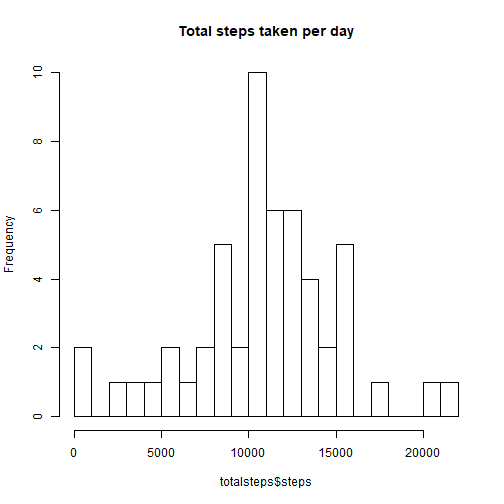
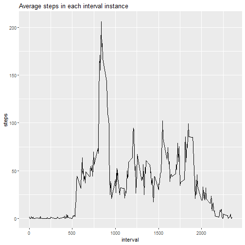
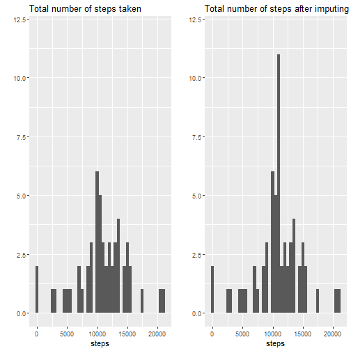
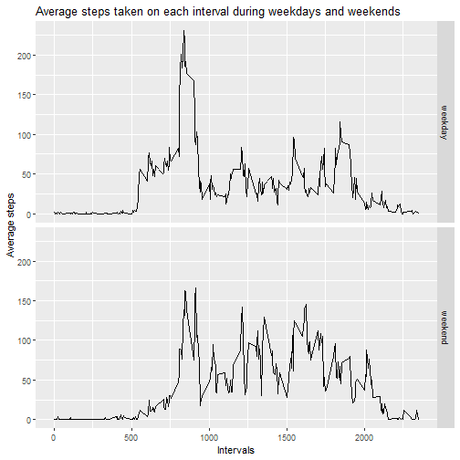

## Loading and preprocessing the data

1. Load the data and preprocess if necessary


```r
data <- read.csv("./data/activity.csv")
data$date <- as.Date(as.character(data$date))
```

## What is mean total number of steps taken per day?

1. Calculate the total number of steps taken per day


```r
library(dplyr)
data <- tbl_df(data)
totalsteps <- data %>% group_by(date) %>% summarize(steps = sum(steps))
head(totalsteps)
```

```
## # A tibble: 6 x 2
##   date       steps
##   <date>     <int>
## 1 2012-10-01    NA
## 2 2012-10-02   126
## 3 2012-10-03 11352
## 4 2012-10-04 12116
## 5 2012-10-05 13294
## 6 2012-10-06 15420
```

2. Make a histogram of the total number of steps taken each day.


```r
hist(totalsteps$steps, breaks = 20, main = "Total steps taken per day")
```



3. Calculate and report the mean and median of the total number of steps taken per day

Mean:


```r
mean(totalsteps$steps, na.rm = TRUE)
```

```
## [1] 10766.19
```

Median:


```r
median(totalsteps$steps, na.rm = TRUE)
```

```
## [1] 10765
```

## What is the average daily activity pattern?

1. Make a time series plot (i.e. type = "l") of the 5-minute interval (x-axis) and the average number of steps taken, averaged across all days (y-axis)


```r
library(ggplot2)
intervalsteps <- data %>% group_by(interval) %>% summarize(steps = mean(steps, na.rm = TRUE))
ggplot(data = intervalsteps, aes(interval, steps)) + geom_line() + labs(title = "Average steps in each interval instance")
```



2. Which 5-minute interval, on average across all the days in the dataset, contains the maximum number of steps?


```r
intervalsteps[which(intervalsteps$steps == max(intervalsteps$steps)),]
```

```
## # A tibble: 1 x 2
##   interval steps
##      <int> <dbl>
## 1      835  206.
```

### Imputing missing values

1. Calculate and report the total number of missing values in the dataset(i.e. the total number of rows with NAs)


```r
sum(is.na(data))
```

```
## [1] 2304
```

2. Devise a strategy for filling in all missing values in the dataset. Create a new dataset with missing data filled in.


```r
# Matches the invterval on original dataset with same interval in average interval table
matchy <- match(data$interval, intervalsteps$interval)
# Create a temporary copy in case we need to use the original dataset
data2 = data
# Replaces the NA values in dataset with the average steps in that interval across all days
for (i in seq_along(data2$steps)){
    if (is.na(data2$steps[i])){
        data2$steps[i] = intervalsteps$steps[matchy[i]]
    }
}
```

3. Make a histogram of the total number of steps taken each day and calculate and report the mean and median total number of steps taken per day. How different are these values with the first part of the assignment?


```r
totalsteps2 <- data2 %>% group_by(date) %>% summarize(steps = sum(steps))
p1 <- qplot(steps, data = totalsteps, binwidth = 500)+ coord_cartesian(ylim = c(0,12)) + ggtitle("Total number of steps taken")
p2 <- qplot(steps, data = totalsteps2, binwidth = 500) + coord_cartesian(ylim = c(0,12)) + ggtitle("Total number of steps after imputing")
library(gridExtra)
grid.arrange(p1,p2,nrow = 1)
```

```
## Warning: Removed 8 rows containing non-finite values (stat_bin).
```



Old values:

```r
mean(totalsteps$steps, na.rm = TRUE)
```

```
## [1] 10766.19
```

```r
median(totalsteps$steps, na.rm = TRUE)
```

```
## [1] 10765
```

New values:

```r
mean(totalsteps2$steps, na.rm = TRUE)
```

```
## [1] 10766.19
```

```r
median(totalsteps2$steps, na.rm = TRUE)
```

```
## [1] 10766.19
```


4. What is the impact of imputing missing data on the estimates of the total daily number of steps?

Because we imputed the missing values with the average steps taken across all days per each interval, the new median values is the same as the mean values.

## Are there differences in activity patterns between weekdays and weekends?

1. Create a new factor variable in the dataset with two levels - "weekday" and "weekend" indicating whether a given date is weekday or weekend day.


```r
# Create a new dataframe
data3 = data2
data3$week<- if_else(weekdays(data2$date) == "Sunday" | weekdays(data2$date) == "Saturday", "weekend", "weekday")
data3$week <- factor(data3$week)
```

2. Make a panel plot containing a time series plot (i.e. type = "l") of the 5-minute interval (x-axis) and the average number of steps taken, averaged across all weekday days or weekend days (y-axis).


```r
## Create a new dataframe
data4 <- aggregate(x = data3$steps, by = list(data3$week, data3$interval), FUN = mean)
names(data4) <- c("week","interval","steps")
ggplot(data = data4, aes(x = interval, y = steps)) + geom_line() + facet_grid(week~.) + xlab("Intervals") + ylab("Average steps") + ggtitle("Average steps taken on each interval during weekdays and weekends")
```


